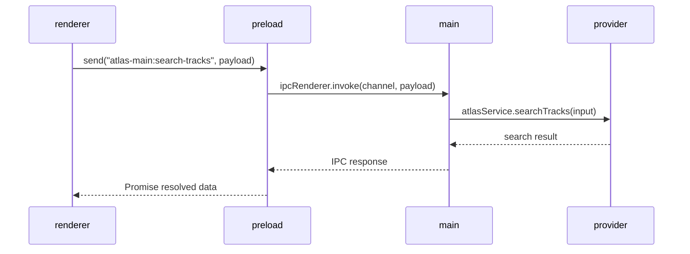
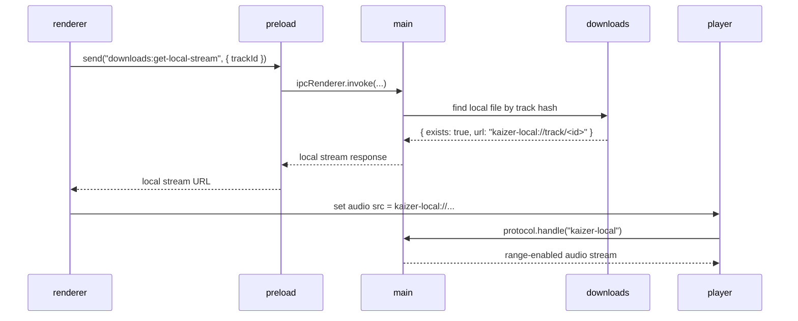

<div align="center">
  <a href="https://github.com/ternilabs/kaizer-music-player">
    
  </a>

<h3 align="center">kaizer-music-player</h3>
</div>

> [!IMPORTANT]
> - The developer (well me) decided to discontinue this project because the third-party APIs used for streaming have gradually become unreliable. ~~However, the project will be released as **open source** soon.~~
> - I'll be creating a `/docs` folder and an `AGENTS.md` file, but not right now.

> [!NOTE]
> This codebase was assisted with coding agent **Codex GPT-5.3** using high intelligence and a well-structured **product requirements document** to help fully build the project, although I still think the implementation is somewhat sloppy.

## Preview


## Overview

Kaizer is a monorepo desktop app focused on:

- Searching tracks from multiple remote providers (`Atlas`, `Orion`, `Helios`, ~~`Nyx`~~)
- Streaming tracks in-app
- Managing playlists
- Downloading tracks for local playback
- Persisting app state in SQLite (`better-sqlite3` + `drizzle-orm`)

## Tech Stack

- Electron 40
- React 19 + Vite 7
- TanStack Router (file-based routes)
- TanStack Query v5 (server state)
- Tailwind CSS v4
- Drizzle ORM + better-sqlite3

## Monorepo Structure

- `packages/main`  
  Electron main process: window lifecycle, IPC, provider services, downloads, storage
- `packages/preload`  
  Preload bridge exposing `send(...)` and utility APIs to renderer
- `packages/renderer`  
  React UI (Search, Downloads, Settings, Playlists, Player)
- `packages/electron-versions`  
  Build helpers for Electron runtime targeting
- `packages/integrate-renderer`  
  Template helper package (not runtime app logic)

## Current Features

- Provider-backed track search with provider fallback chain based on selected preferred server
- Album details dialog with track listing
- Stream playback with player controls
- Playlist CRUD and playlist track management
- Downloads page with selection, add-to-playlist, delete, and bulk delete
- Local stream source (`kaizer-local://...`) when track is downloaded
- Configurable storage capacity guard for downloads
- Optional “Download while streaming” mode
- Server health refresh from Settings
- Local state snapshot persistence to SQLite

## Provider Support

- `atlas-main` (+ internal fallback: `atlas-alt`)
- `orion-main`
- `helios-main` (+ internal fallbacks: `helios-alt-01` ... `helios-alt-09`)
- `nyx-main`

Note: `kaizer-main` is currently treated as offline/disabled in app behavior.

## Local Data & Files

Kaizer stores runtime data in Electron `app.getPath('userData')`.

Inside that folder:

- `kaizer.db`  
  SQLite DB (playlists, tracks, downloads index, settings, logs)
- `downloads/`  
  Downloaded audio files (`.flac`) with safe filename + hash suffix

Typical `userData` locations:

- Linux: `~/.config/<app-name>`
- macOS: `~/Library/Application Support/<app-name>`
- Windows: `%APPDATA%\\<app-name>`

(`app-name` depends on Electron app metadata at runtime.)

## Prerequisites

- Node.js `>=23.0.0` (enforced by `package.json`)
- npm

## Getting Started

```bash
npm install
npm start
```

This starts development mode:

- Renderer Vite dev server
- Main + preload watched/rebuilt
- Electron app auto-restarted on main process rebuild

## Build

Build all workspaces:

```bash
npm run build
```

Build distributable app via electron-builder:

```bash
npm run compile
```

Build Linux `.deb` specifically:

```bash
npm run compile -- --linux deb
```

Build Windows portable `.exe` specifically:

```bash
npm run compile -- --win portable
```

Artifacts are generated under `dist/`.

## Useful Scripts

Root:

- `npm start` - run Electron dev mode
- `npm run build` - build all workspaces
- `npm run compile` - build + package app
- `npm run typecheck` - typecheck all workspaces
- `npm test` - run Playwright test entry

Main package (`packages/main`):

- `npm run build --workspace @app/main`
- `npm run typecheck --workspace @app/main`
- `npm run db:generate --workspace @app/main`
- `npm run db:migrate --workspace @app/main`

Renderer package (`packages/renderer`):

- `npm run dev --workspace @app/renderer`
- `npm run build --workspace @app/renderer`
- `npm run lint --workspace @app/renderer`

## Architecture Notes

- Renderer calls backend via preload `send(channel, payload)` and IPC handlers in `packages/main/src/modules/*Ipc.ts`.
- Persistent app snapshot is loaded/saved through:
  - `storage:get-bootstrap`
  - `storage:save-snapshot`
- Download/stream local file flow is handled by `DownloadsIpc` and custom protocol `kaizer-local`.
- Minimum window size is enforced at `1440 x 1006`, and window opens centered.

### Process Boundary (Important)

- `packages/renderer` runs as web code. Do not use Node-only modules there.
- `packages/preload` is the bridge layer. Expose APIs here and call them from renderer.
- `packages/main` handles Electron APIs, provider networking, filesystem access, and IPC handlers.

In short: renderer -> preload -> main.

### IPC Flow Diagram



### Local Playback Flow (Downloaded Track)



### Sample Code (Current Pattern)

Preload bridge:

```ts
// packages/preload/src/index.ts
import { ipcRenderer } from 'electron'

export function send(channel: string, payload?: unknown) {
  return ipcRenderer.invoke(channel, payload)
}
```

Renderer usage:

```ts
// packages/renderer/src/routes/search.tsx
import { send } from '@app/preload'

const response = await send('atlas-main:search-tracks', {
  query: 'Just a Feeling',
  offset: 0,
  type: 'track',
})
```

Main process handler:

```ts
// packages/main/src/modules/AtlasIpc.ts
ipcMain.handle('atlas-main:search-tracks', async (_event, rawInput) => {
  return atlasService.searchTracks(toSearchInput(rawInput))
})
```

Local stream lookup:

```ts
// renderer (PlayerBar): prefer local stream before remote provider stream
const local = await send('downloads:get-local-stream', { trackId: track.id })
if (local.exists && local.url) {
  audio.src = local.url
  await audio.play()
}
```

### Working with Dependencies

- Browser-safe packages (React UI libs, utility libs, etc.) belong in `renderer`.
- Node/Electron APIs (filesystem, process/runtime, privileged Electron APIs) belong in `main` or `preload`.
- If renderer needs privileged behavior, add a preload-exposed API and call it via `@app/preload`.

### Modes and Environment

Development entrypoint is `npm start` (uses `packages/dev-mode.js`), which:

- starts renderer Vite dev server
- builds/watches preload and main
- relaunches Electron on rebuild

Vite environment files follow standard loading behavior:

- `.env`
- `.env.local`
- `.env.[mode]`
- `.env.[mode].local`

Only `VITE_*` variables are exposed to renderer-side code.

## Troubleshooting

### `better-sqlite3` Node module version mismatch

If Electron and locally-built native module versions differ, you may see:

`ERR_DLOPEN_FAILED ... NODE_MODULE_VERSION ...`

Rebuild the native module against Electron:

```bash
npm rebuild better-sqlite3 --runtime=electron --target=40.2.1 --dist-url=https://electronjs.org/headers
```

Then restart the app.

### Search/provider failures

- Use Settings -> Servers refresh to verify provider health.
- If selected provider is unavailable, app will attempt fallback providers for search.

### Build a debuggable unpacked app

Useful for debugging packaged output without installer:

```bash
npm run compile -- --dir -c.asar=false
```

## Disclaimer
This project is intended for **educational and private use only**. The developer does not condone or encourage **copyright infringement**.

This is a third-party tool and is not affiliated with, endorsed by, or connected to any streaming service or platform.

You are solely responsible for:
- Ensuring your use of this software complies with applicable laws in your jurisdiction
- Reviewing and complying with the Terms of Service of any platforms you use with this tool
- Any consequences resulting from misuse of this software

This software is provided “as is”, without warranty of any kind. The author assumes no liability for bans, damages, claims, or legal issues arising from the use or misuse of this tool.

## Special credits

- [dabmusic.xyz](https://dabmusic.xyz) as **Atlas** Qobuz third-party provider
- [Monochrome](https://github.com/monochrome-music/monochrome) as **Helios** Tidal third-party provider
- [SquidWTF](https://qobuz.squid.wtf/) as **Orion** Qobuz third-party provider
- [LRCLIB](https://lrclib.net/) as lyrics provider
- [vite-electron-builder](https://github.com/cawa-93/vite-electron-builder) as codebase structure

## License

This project is licensed under the **Apache License 2.0**. You are free to use, modify, and distribute this project, provided that proper attribution and license notices are retained. See the [LICENSE](./LICENSE) file for full details.
